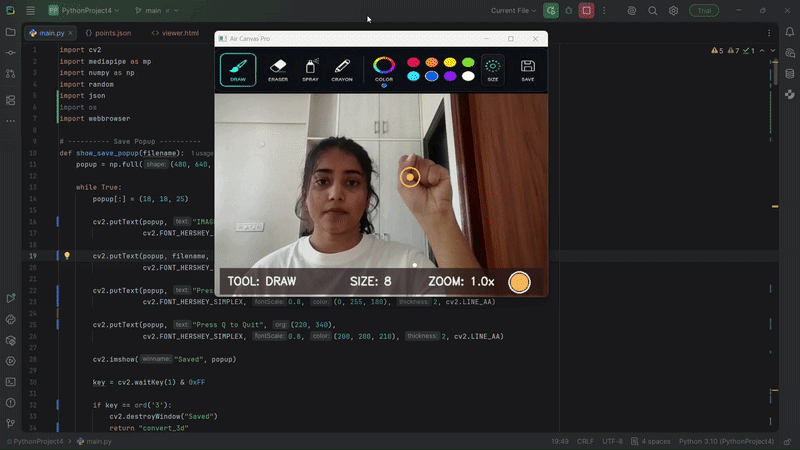

# Air Canvas Pro

Gesture-based touchless drawing system built with OpenCV and MediaPipe.

## Demo



## Features
- Real-time hand tracking
- Air drawing using index finger
- Tool selection using gestures
- Draw, eraser, spray, and crayon tools
- Brush size control using vertical slider
- Gesture-based zoom in/out
- Dark themed interface
- Save popup after exporting image
- Reset canvas support

## Tech Stack
- Python
- OpenCV
- MediaPipe
- NumPy

## Controls
| Action | Control |
|---|---|
| Draw | Index finger |
| Select tool | Index + middle finger |
| Zoom | Index + middle + ring + pinch |
| Reset | R key |
| Quit | Q key |

## Installation
```bash
git clone YOUR_REPO_LINK
cd air-canvas-pro
pip install -r requirements.txt
python main.py